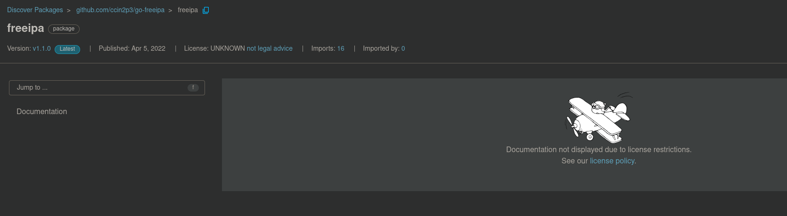

# go-freeipa

## Update

1) Change the ```SanDnsname``` of ```type Cert Struct ``` to be ```SanDnsname *[]map[string]interface{} `json:"san_dnsname,omitempty" ```
2) Change the ```ValidNotBefore``` of ```type Cert Struct ``` to be ```string `json:"valid_not_before,omitempty"` ```
3) Change the ```ValidNotAfter``` of ```type Cert Struct ``` to be ```string `json:"valid_not_after,omitempty"` ```
4) Update the ```SanDnsname``` handle part from ```func (out *Cert) UnmarshalJSON(data []byte) error ``` to be
```
  if in.SanDnsname != nil {
    raw := in.SanDnsname
    sliceWrapperV, sliceWrapperOk := raw.([]interface{})
    var sliceV []map[string]interface{}
    sliceOk := sliceWrapperOk
    fmt.Printf("Type of integerVariable: %T\n", raw)

    if sliceWrapperOk {
      for _, rawItem := range sliceWrapperV {
        itemV, itemOk := rawItem.(map[string]interface{})
        if itemOk {
          sliceV = append(sliceV, itemV)
        }
        
      }
    }
```


[](https://pkg.go.dev/github.com/ccin2p3/go-freeipa)

A generated golang client for the FreeIPA API.

See the [godoc](https://godoc.org/github.com/ccin2p3/go-freeipa/freeipa) for
usage examples and more info. See
[`developing.md`](https://github.com/ccin2p3/go-freeipa/blob/master/developing.md)
for information on how this library is generated.

## Features

* Kerberos and password API authentication

## History and credits

### Origins

This project was initially created by [Philippe Voinov](https://github.com/tehwalris).

The initial project is now _archived_ and [unmaintained](https://github.com/tehwalris/go-freeipa#unmaintained).

We want to thank [Philippe Voinov](https://github.com/tehwalris) for all the awesome work he did on this library.

### Future

[IN2P3 Computing Centre](https://cc.in2p3.fr) will provide support for this library and try to make it evolve as much as possible.

Feel free to open [issues](https://github.com/ccin2p3/go-freeipa/issues) or [pull requests](https://github.com/ccin2p3/go-freeipa/pulls) to discuss.

## Known issues

### pkg.go.dev website refuses to display documentation

[](https://pkg.go.dev/github.com/ccin2p3/go-freeipa/freeipa)

The official [pkg.go.dev license policy](https://pkg.go.dev/license-policy) does not actually accepts the [CeCILL LICENSE](https://cecill.info/index.en.html) we're using.

We're aware of this and an [issue was opened to request the recognition of the CeCILL LICENSE on the pkg.go.dev](https://github.com/golang/go/issues/52126).
